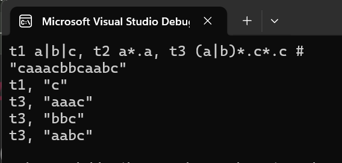

# Configurable Lexer

A **dynamic C++ lexer** that builds NFAs and DFAs from **user-defined token definitions** at runtime — no Flex or hard-coded rules. Demonstrates **automata theory**, **compiler design**, and **algorithm implementation** in action.

---

## Key Highlights

- Users provide **tokens with regular expressions** at runtime.
- Implements **infix → postfix → NFA → DFA** pipeline.
- Supports **Kleene star (*), concatenation (.), alternation (|)**.
- Identifies **longest matching token** in an input string dynamically.
- Fully configurable — works with **any valid token definitions**.

---

## Usage

Four example input files are provided. You can run the lexer in one of two ways:
1. **Copy & paste** the contents of an example file directly into the program.
2. **Redirect input** from an example file using the command line.

---

*Lexer tokenizing input using user-defined token definitions.*
